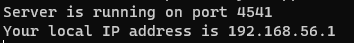
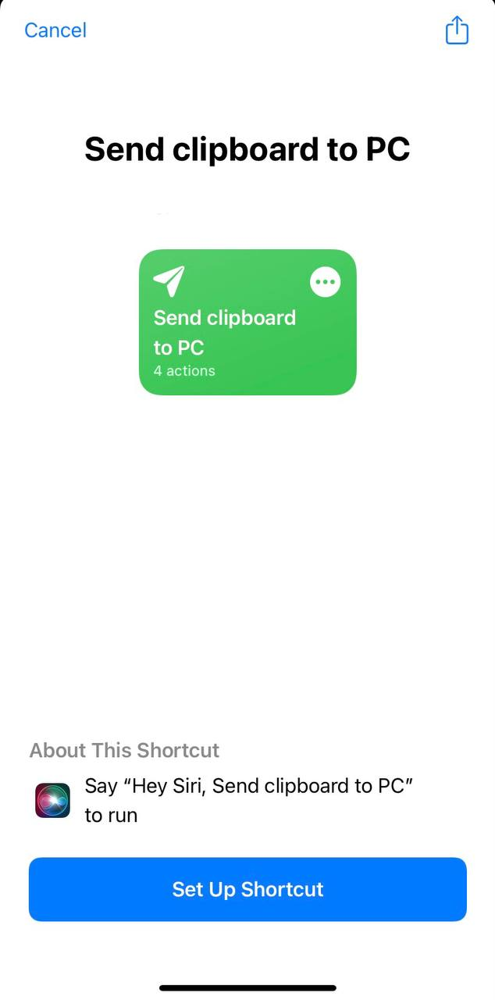
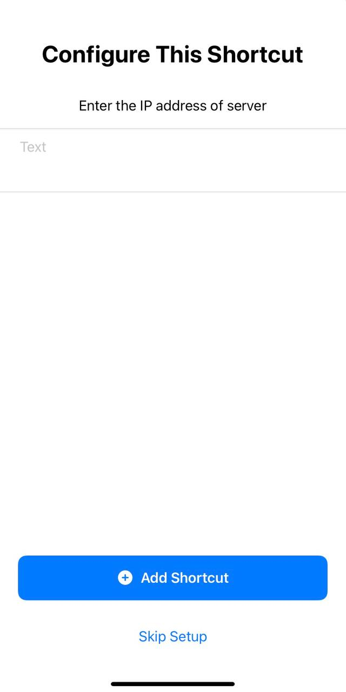

# Clipboard Sync between iOS and Windows

### This application works by hosting a NodeJS server on the Windows device, the shortcuts app on iPhone will use a shortcut to share the clipboard with the Windows device.
 

# Set up

> This application uses NodeJS, make sure you have it installed on your device

## Setting up on Windows device
1. Clone the repository into your computer.
2. Go to the directory of the cloned repository.
3. Type `npm i` to install the dependencies.
4. Run the server by typing `node app.js`
5. If you see the message "Server started on port 4541" then your server is successfully running. 
   
6. Make a note of your IP address shown which will be helpful when setting up the shortcut on your iOS device.

## Setting up on iOS device
1. You can get the [shortcut](https://www.icloud.com/shortcuts/dcfd66a0315243f3b9dd033f88137add) by clicking the [link](https://www.icloud.com/shortcuts/dcfd66a0315243f3b9dd033f88137add). 
   
2. After saving the shortcut you will be asked to setup, enter the IP address shown in the console of your computer and then click done 
   
   > Don't try to tap on "Skip Shortcut" else the shortcut wouldn't work.
3. Copy anything to your clipboard on your iOS device and then execute the shortcut, the clipboard will get shared to your computer.

> Disclaimer: This shortcut can only transfer text, I will try to make the shortcut transfer files.

# Making the server work in background

Users may not feel comfortable to see the console lying around (especially when multitasking). You can use pm2 npm package to run the NodeJS server in the background.

1. Install a package called pm2 by typing `npm i pm2 -g` in your console. PM2 helps in running your NodeJS files in background.
2. After a successful installation type `pm2 start app.js` in console which is in the repository directory.

# Starting the server on system start-up

You need to create a batch file which will contain the command `pm2 start ` and then the full path of app.js file of the repository. Copy this batch file to Start-Up folder in your start menu folder. The server should start everytime you start your computer. Batch files have the extension '.bat'

> ## Pro Tip: You can use Siri to do the trasnfer, just activate Siri and say "Sync clipboard with PC" and it'll be done

> Plans of further developments in this project 
> ~~1. Transfer clipboard from iOS device and Windows device and back.~~ 
> 2. Transfer files
